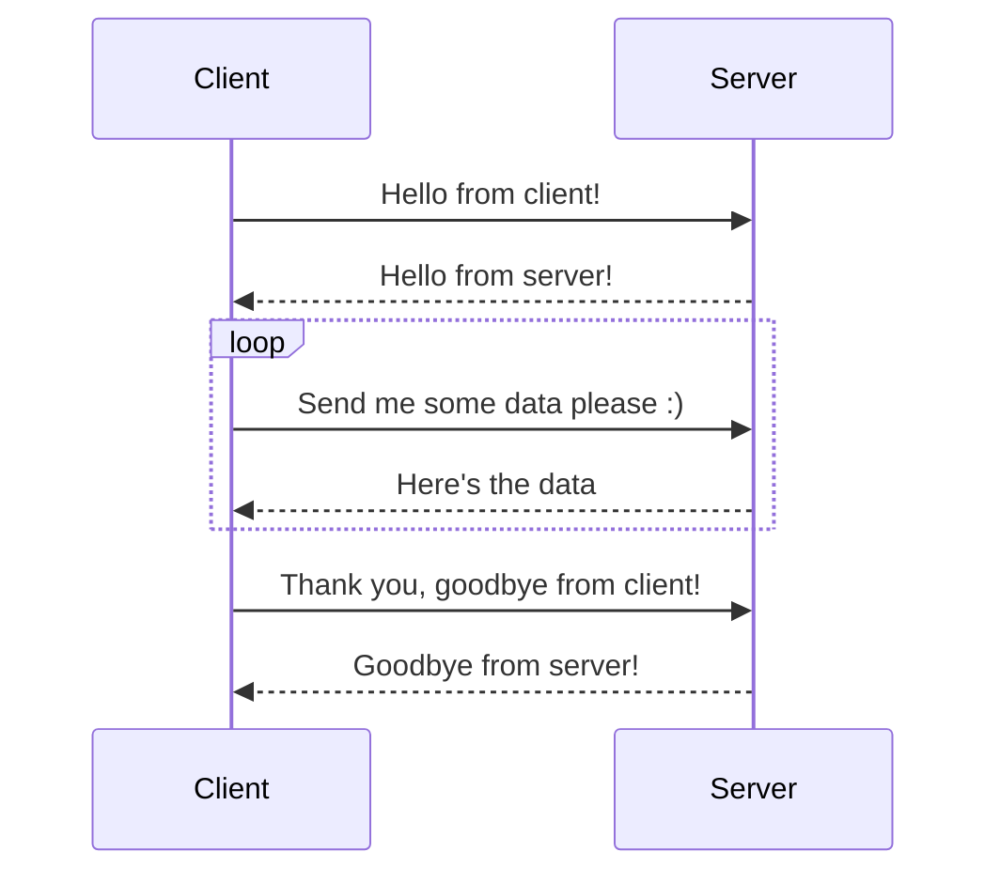

Prompt: Generate a Go program with 2 system processes from this mermaid diagram, all the messages must be sent through channels in the correct order:

```mermaid
sequenceDiagram
    Client->>Server: Hello from client!
    Server-->>Client: Hello from server!
    loop
    Client->>Server: Send me some data please :)
    Server-->>Client: Here's the data
    end
    Client->>Server: Thank you, goodbye from client!
    Server-->>Client: Goodbye from server!
```