Generate a GitHub Actions workflow skeleton from the following mermaid diagram.
Each mermaid block should be a GitHub Actions job. Each job should only contain one debugging step, printing the job name. Please respect the jobs' dependencies by using the 'needs' keyword at the job level.

```mermaid
graph TD;
  hello["👋 - Starting"] --> build["🚧 - Build & Test"];
  build --> build_publish_container["🐳 - Push container image to GitHub Packages"];
  build_publish_container --> deploy-to-azure-aci["Azure ACI deployment"];
  build_publish_container --> deploy-to-aws-ecs["AWS ECS deployment"];
  build_publish_container --> deploy-to-gcp-cloudrun["GCP Cloud Run deployment"];
  deploy-to-azure-aci --> bye["👋 - Goodbye"];
  deploy-to-aws-ecs --> bye;
  deploy-to-gcp-cloudrun --> bye;
```

