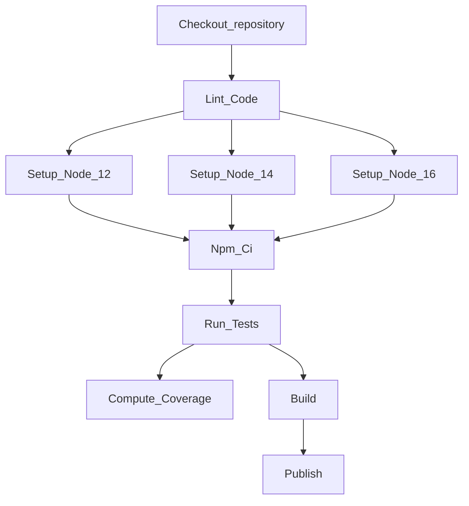

Generate a GitHub Actions workflow skeleton from this mermaid diagram.
 
This workflow should:
  * run on ubuntu-latest only
  * use matrix to handle multiple nodes versions
  * use https://registry.npmjs.org as the registry URL
  * use NPM_TOKEN Actions secret for authentication

