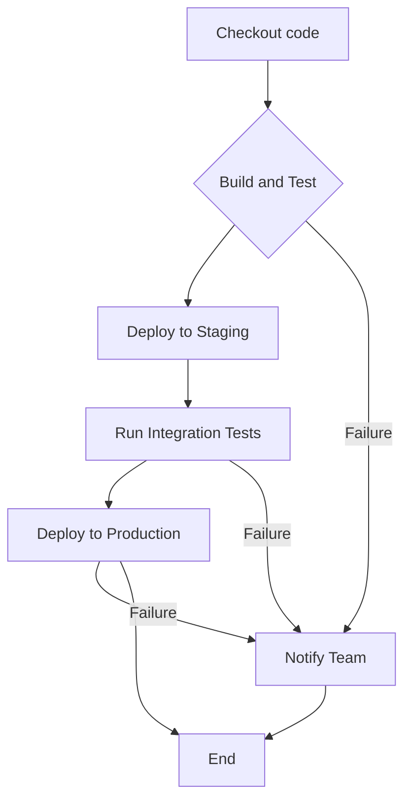

Generate a GitHub Actions workflow skeleton from this mermaid diagram, with the following requirements:
* "Checkout code" and "Build and Tests" should be part of a dedicated Actions job;
* "Deploy to Staging" and "Run Integration Tests" should be part of another dedicated Actions job;
* "Deploy to Production" should be part of a separate Actions job;
* "Notify Team" should be part of a separate Actions job.
 
