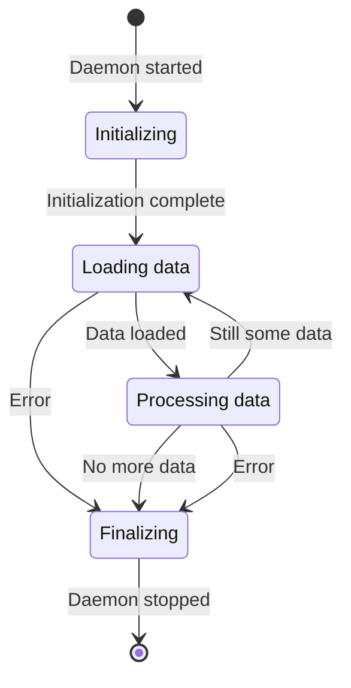

## How-to

Open the Copilot Chat and ask the following (including the Mermaid diagram):

Generate a daemon program in Python from this mermaid state diagram.
Each state must be a function that returns the next state. 
If multiple next states are possible, choose based on user input.
The daemon should stop after the Finalizing state.

